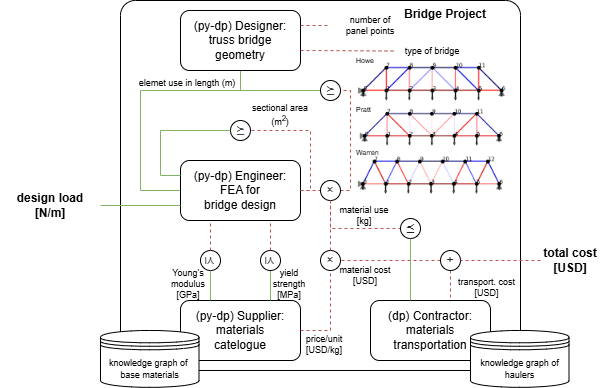

# Truss Bridge Simulation

This project is a co-design framework with Python-based simulation and knowledge graph integration to provide optimal solution in engineering design. The co-design diagram is as below:




## Features

- A python dp-like code block for optimizing sectional areas of truss using finite element analysis for three base truss: **Howe**, **Pratt**, and **Warren** with the given design line load.
- Simple python implemetation to integrate knowledge graph into physical models and mcdpl package.
- 2D Visualization of the bridge structure, forces, and constraints.
- Mcdpl query to find the optimal solution under the given conditions, which levarage  **FUNTIONALITY** and **RESOURCES**.

## Requirements

To run this project, ensure you have the following installed:
- Python 3.x
- `numpy`
- `torch`
- `torchfem`
- `matplotlib`
- `networkx`

Install the required packages using:
```bash
pip install numpy torch matplotlib networkx torchfem
```

## Usage

Please see `bridge_project.ipynb`


## License

This project is a term project for 1.S980: Applied Category Theory for Engineering Design at Massachusetts Institute of Technology, lectured by Prof. Gioele Zardini and TA'ed by  Yujun Huang.

Special thanks to Gioele and Yujun for the helps and ideas in our disscusion. 
